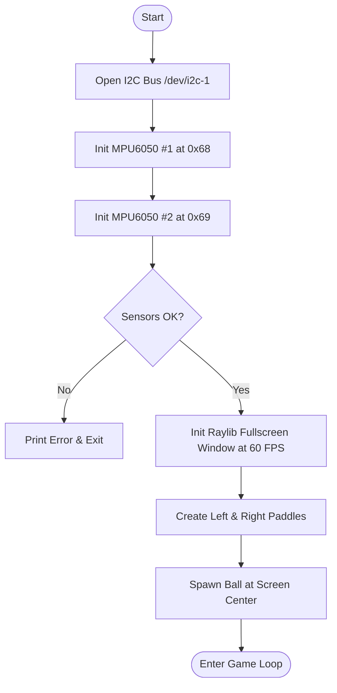
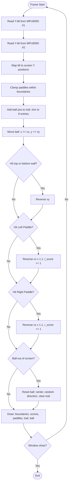
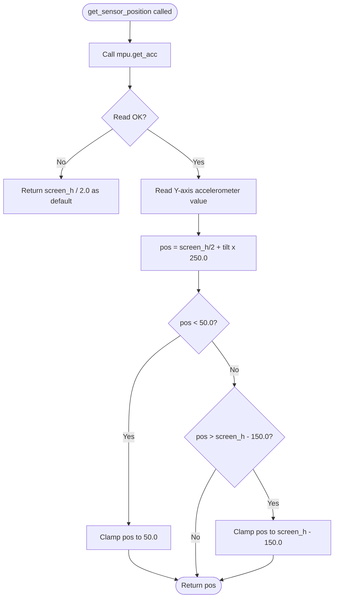

# SKILL LAB PRACTICAL HACKATHON

## Final Project README

---

# 1. Team Identity

## 1.1 Studio / Group Name

`AirPaddle Group No 21`

## 1.2 Team Members

| Name | Primary Role | Secondary Role | Strengths Brought to the Project |
| --- | --- | --- | --- |
| `Sakshi Thakare` | `Electronics / Coding / App` | `Coding` | `Hardware` |
| `Viraj Pradhan` | `Electronics / Fabrication` | `Coding` | `Hardware` |
| `Umair Shaikh` | `Electronics / Coding / App` | `Documentation` | `Documentation, Gift of Gab` |
| `Bhushan Sonawane` | `Electronics / Fabrication` | `Documentation` | `Documentation, Gift of Gab` |

## 1.3 Project Title

`"Project AirPaddle — Gesture-Controlled Ping Pong"`


## 1.4 One-Line Pitch

`A multiplayer ping pong game where players control paddles using hand gestures through MPU6050 motion sensors connected to Raspberry Pi.`

## 1.5 Expanded Project Idea

`Our project is a gesture-controlled Ping Pong game built using Raspberry Pi, MPU6050 motion sensors, and a display interface. Instead of using a keyboard or joystick, players use hand movements to control the paddles in the game.`

`Each player holds an MPU6050 sensor, which detects motion such as upward and downward tilt. These motion values are read directly by the Raspberry Pi over I2C, where the main game logic runs using Rust and Raylib. The Raspberry Pi processes the gestures and moves the paddles accordingly on the display screen.`

`Since OLED and external buttons were unavailable, the complete interface including game start, restart, and controls is handled directly on the Raspberry Pi display. This creates a simple but highly interactive gaming experience using embedded systems and sensor-based control.`

---

# 2. Inspiration

## 2.1 References

| Source Type | Title / Link | What Inspired You |
| --- | --- | --- |
| `Video` | `https://www.instagram.com/reel/DW4CT7WCDry/?igsh=cXg3dzAxYmdncDBo` | `How projection mapping can be used to create interactive digital + physical experiences` |

## 2.2 Original Twist

`Unlike traditional keyboard or joystick-based ping pong games, our project uses dual MPU6050 motion sensors connected directly to a Raspberry Pi via I2C to create a real-time gesture-controlled multiplayer gaming experience. Each player physically tilts a handheld controller containing the MPU6050 sensor, and the Raspberry Pi processes these motion values instantly in a Rust + Raylib game engine to move the paddles on-screen. The project combines embedded electronics, accelerometer-based input, Rust game development, and real-time motion tracking into an interactive physical gaming system.`

---

# 3. Project Intent

## 3.1 User Journey

`The user starts the Raspberry Pi system and launches the AirPaddle game on the display screen. Each player holds an MPU6050 motion sensor in their hand. Once the game begins, players tilt their hands upward or downward to control their paddles on the screen.`

`The Raspberry Pi continuously reads motion data from both MPU6050 sensors through the I2C interface and processes the tilt values in Rust using Raylib. As players move their hands, the paddles respond in real time, creating a gesture-based multiplayer ping pong experience.`

`Players compete by trying to block and return the moving ball. The ball speeds up with every paddle hit, making the gameplay progressively more challenging. The game resets the ball automatically whenever it crosses a boundary, and the score is displayed live on screen throughout the match.`

---

# 4. Definition of Success

## 4.1 Definition of "Usable"

`The project is considered usable when both MPU6050 sensors successfully control the paddles in real time with smooth motion tracking, the ball physics work correctly, and two players can play the game continuously without major lag, crashes, or sensor disconnects.`

## 4.2 Minimum Usable Version

`The minimum usable version includes two MPU6050 sensors connected to Raspberry Pi through I2C (addresses 0x68 and 0x69), a Raylib fullscreen window displaying paddles and a moving ball, and gesture-based paddle movement using Y-axis tilt readings from both sensors.`

## 4.3 Stretch Features

- `Smash detection using sudden acceleration spikes`
- `Scoreboard system with win tracking`
- `Sound effects and background music`
- `AI single player mode`
- `Real-time motion visualization graphs`
- `Wireless sensor communication using ESP32`
- `Gesture calibration menu`
- `Full-screen arcade mode with win condition`

---

# 5. System Overview

## 5.1 Project Type

- [x] Electronics-based
- [x] Mechanical
- [x] Sensor-based
- [x] App-connected
- [ ] Motorized
- [x] Sound-based
- [ ] Light-based
- [x] Screen/UI-based
- [x] Fabricated structure
- [x] Game logic based
- [x] Installation
- [ ] Other:

## 5.2 High-Level System Description

The system uses two MPU6050 motion sensors connected to the Raspberry Pi through the I2C communication protocol. Each sensor detects the tilt and motion of a player's hand using its onboard accelerometer.

The Raspberry Pi processes these motion values using a Rust-based game engine built with Raylib. The Y-axis tilt values are mapped to vertical paddle position inside a multiplayer ping pong game running at 60 FPS.

The HDMI display connected to the Raspberry Pi shows the live game interface, including paddle movement, ball physics, trail effect, and score in real time.

## 5.3 Input / Output Map

| System Part | Type | What It Does |
| --- | --- | --- |
| MPU6050 Sensor 1 (0x68) | Input | Detects hand tilt for Player 1 paddle |
| MPU6050 Sensor 2 (0x69) | Input | Detects hand tilt for Player 2 paddle |
| Raspberry Pi 4 | Processing | Reads sensor data and runs game logic |
| Rust + Raylib | Software | Renders game graphics and physics at 60 FPS |
| HDMI Display Screen | Output | Shows live ping pong gameplay |
| I2C Communication | Communication | Transfers motion data from both sensors |

---

# 6. System Design, Sketches and Visual Planning

## 6.1 Concept Architecture / Sketch / Schematic


## 6.2 Labeled Build Sketch / Architecture / Flow Diagram

**I2C Wiring Architecture:**

```
Raspberry Pi 4
┌───────────────────────────┐
│  GPIO2 (SDA) ─────────────┼──┬──── MPU6050 #1  AD0 → GND   (address 0x68)
│  GPIO3 (SCL) ─────────────┼──┤──── MPU6050 #2  AD0 → 3.3V  (address 0x69)
│  3.3V        ─────────────┼──┤──── VCC (both sensors)
│  GND         ─────────────┼──┴──── GND (both sensors)
└───────────────────────────┘
              │
         HDMI Cable
              │
       ┌──────────────┐
       │ Display Screen│
       └──────────────┘
```

## 6.3 Approximate Dimensions

| Dimension | Value |
| --- | --- |
| Length | `16 cm` |
| Width | `16 cm` |
| Height | `8 cm` |
| Estimated weight | `400 g` |

---

# 7. Electronics Planning

## 7.1 Electronics Used

| Component | Quantity | Purpose |
| --- | ---: | --- |
| `Raspberry Pi 4` | `1` | `Main game processing unit` |
| `MPU6050 Motion Sensor` | `2` | `Detect player hand gestures via accelerometer` |
| `HDMI Display` | `1` | `Display game interface` |
| `Jumper Wires` | `Several` | `I2C and power connections` |
| `Breadboard` | `1` | `Temporary prototyping connections` |
| `Power Adapter (5V)` | `1` | `Power Raspberry Pi` |

## 7.2 Wiring Plan

Both MPU6050 sensors are connected to the Raspberry Pi using the I2C communication protocol. The SDA pins of both sensors are connected to GPIO2 (Pin 3), and the SCL pins are connected to GPIO3 (Pin 5). Both sensors share common 3.3V power and GND connections.

To avoid I2C address conflicts, the AD0 pin of the first MPU6050 is connected to GND, giving it address **0x68**, while the AD0 pin of the second MPU6050 is connected to 3.3V, changing its address to **0x69**.

The Raspberry Pi continuously reads motion data from both sensors and maps the Y-axis tilt values to paddle position in the game.

## 7.3 Circuit Diagram

```
MPU6050 #1 (0x68)          MPU6050 #2 (0x69)
┌──────────────┐            ┌──────────────┐
│ VCC → 3.3V   │            │ VCC → 3.3V   │
│ GND → GND    │            │ GND → GND    │
│ SDA → GPIO2  │            │ SDA → GPIO2  │
│ SCL → GPIO3  │            │ SCL → GPIO3  │
│ AD0 → GND    │            │ AD0 → 3.3V   │
└──────────────┘            └──────────────┘
        └──────────┬─────────────┘
               Raspberry Pi 4
```

## 7.4 Power Plan

| Question | Response |
| --- | --- |
| Power source | `5V Power Adapter via USB-C` |
| Voltage required | `5V for Raspberry Pi; 3.3V for MPU6050 sensors (supplied by Pi GPIO)` |
| Current concerns | `Sensors draw minimal current (~3.9 mA each); Raspberry Pi is the main load` |
| Safety concerns | `Avoid reverse polarity on sensor VCC/GND; ensure stable 5V supply to prevent Pi brownouts during I2C reads` |

---

# 8. Software Planning

## 8.1 Software Tools

| Tool / Platform | Purpose |
| --- | --- |
| `Rust (Edition 2024)` | `Main programming language for game logic` |
| `Cargo` | `Rust package manager and build system` |
| `Raylib 5.5.1` | `Graphics rendering and game framework` |
| `linux-embedded-hal` | `I2C device access on Raspberry Pi Linux` |
| `mpu6050 crate` | `Sensor communication and accelerometer reading` |
| `rand crate` | `Random ball direction on reset` |
| `Raspberry Pi OS` | `Runs the complete game system` |
| `Nano / VS Code` | `Code editing and debugging` |

## 8.2 Software Logic / Algorithm

**Startup behavior:**
The Raspberry Pi opens both I2C devices on `/dev/i2c-1`, initializes MPU6050 #1 at 0x68 and MPU6050 #2 at 0x69, then creates a fullscreen Raylib window locked to 60 FPS.

**Input handling:**
Every frame, tilt values are read from both MPU6050 sensors via the `get_acc()` call. The Y-axis accelerometer value is used as the tilt input for each player's paddle.

**Sensor reading:**
`get_sensor_position()` reads the Y-axis acceleration, multiplies by 250.0 to convert to screen pixels, and clamps the result between 50px and `screen_height - 150px`. On read error, it defaults to screen center so the game never crashes.

**Decision logic:**
Tilt values are mapped directly to paddle Y positions. Circle-rectangle collision detection checks the ball against each paddle. On hit, the ball reverses X direction and speed multiplies by 1.1×. Score increments on every successful paddle hit.

**Output behavior:**
Raylib renders each frame: top/bottom boundary lines, dashed center divider, scores, left and right paddles, ball trail (last 8 positions in grey), and the ball in white.

**Communication logic:**
Both MPU6050 sensors communicate with Raspberry Pi using shared SDA and SCL I2C lines. Address separation (0x68 / 0x69 via AD0 pin) allows both sensors to coexist on one bus without conflict.

**Reset behavior:**
When the ball's X coordinate leaves the screen bounds, `ball.reset()` is called — ball returns to center, velocity randomizes direction, trail clears, and hit count resets.

## 8.3 Code Flowchart

**1. Startup Flow:**



**2. Main Game Loop:**



**3. Sensor Reading Detail:**



---

# 9. Bill of Materials

## 9.1 Full BOM

| Item | Quantity | In Kit? | Need to Buy? | Estimated Cost (₹) | Material / Spec | Why This Choice? |
| --- | ---: | --- | --- | ---: | --- | --- |
| `Raspberry Pi 4` | `1` | `Yes` | `No` | `0` | `4GB RAM, 64-bit` | `Main processing unit with native I2C support` |
| `MPU6050 Sensor` | `2` | `Yes` | `No` | `0` | `6-axis IMU, I2C` | `Accurate tilt detection, configurable I2C address via AD0` |
| `HDMI Display` | `1` | `Yes` | `No` | `0` | `Any HDMI monitor` | `Game output display` |
| `Jumper Wires` | `Several` | `Yes` | `No` | `0` | `Male-to-female` | `I2C and power connections` |
| `Breadboard` | `1` | `Yes` | `No` | `0` | `Standard 400 tie` | `Prototyping sensor connections` |
| `Power Adapter` | `1` | `Yes` | `No` | `0` | `5V 3A USB-C` | `Powers Raspberry Pi stably` |

## 9.2 Material Justification

`MPU6050 sensors were chosen because they provide reliable 6-axis motion data (accelerometer + gyroscope) over I2C with a configurable address pin (AD0), allowing two sensors to share one I2C bus without conflict. Raspberry Pi 4 was chosen as the processing unit because it natively supports I2C, runs Rust binaries, and can drive a full HDMI display — all in one board. Raylib was chosen over Pygame because it compiles to a fast native binary in Rust with minimal overhead, giving consistent 60 FPS on the Pi hardware.`

## 9.3 Items Procured

| Item | Why Needed | Purchase Link | Latest Safe Date to Procure | Status |
| --- | --- | --- | --- | --- |
| `MPU6050 x2` | `Gesture input for both players` | `robu.in` | `Before Bi-Hour 2` | `Received` |
| `Jumper Wires` | `I2C wiring` | `Campus kit` | `Before Bi-Hour 1` | `Received` |
| `Breadboard` | `Prototyping` | `Campus kit` | `Before Bi-Hour 1` | `Received` |

## 9.4 Budget Summary

| Budget Item | Estimated Cost (₹) |
| --- | ---: |
| Electronics | `400` |
| Mechanical parts | `200` |
| Fabrication materials | `0 (Available on campus)` |
| Purchased extras | `0` |
| Contingency | `300` |
| **Total** | **`900`** |

## 9.5 Budget Reflection

`All core electronic components were available in the campus kit, keeping electronics cost near zero. The main expenses were mechanical enclosure materials. Dropping the ESP32 wireless module from scope further reduced cost. If further reduction were needed, the enclosure could be replaced with a simple cardboard box and the breadboard reused as-is.`

---

# 10. Planning the Work

## 10.1 Team Working Agreement

`Tasks were divided by skill: Sakshi and Viraj handled hardware wiring and sensor integration; Umair and Bhushan handled software logic, documentation, and testing. Decisions were made by quick group agreement — with the most experienced member in that area having the deciding input when opinions differed. Progress was checked at the end of every bi-hour milestone. If a task was delayed, it was immediately flagged to the group and a simpler alternative was agreed upon so the build wouldn't be blocked. Documentation was maintained continuously by Umair and Bhushan, updated after every major change or test result.`

## 10.2 Task Breakdown

| Task ID | Task | Owner | Estimated Hours | Deadline | Dependency | Status |
| --- | --- | --- | ---: | --- | --- | --- |
| T1 | `Finalize concept and BOM` | `All` | `1` | `Bi-Hour 1` | `None` | `Done` |
| T2 | `Wire both MPU6050 sensors to Raspberry Pi` | `Sakshi, Viraj` | `1` | `Bi-Hour 1` | `T1` | `Done` |
| T3 | `Verify I2C addresses (0x68, 0x69)` | `Sakshi` | `0.5` | `Bi-Hour 1` | `T2` | `Done` |
| T4 | `Write Rust sensor reading and tilt mapping` | `Sakshi` | `2` | `Bi-Hour 2` | `T3` | `Done` |
| T5 | `Build Raylib game loop with ball and paddles` | `Viraj` | `2` | `Bi-Hour 2` | `T4` | `Done` |
| T6 | `Fabricate controller enclosure` | `Viraj, Bhushan` | `1.5` | `Bi-Hour 3` | `T2` | `Done` |
| T7 | `Integrate sensors into enclosure and full test` | `All` | `1` | `Bi-Hour 3` | `T5, T6` | `Done` |
| T8 | `Playtest and debug` | `All` | `1` | `Bi-Hour 4` | `T7` | `Done` |
| T9 | `Complete documentation` | `Umair, Bhushan` | `1` | `Bi-Hour 4` | `T8` | `Done` |

## 10.3 Responsibility Split

| Area | Main Owner | Support Owner |
| --- | --- | --- |
| Concept | `Umair` | `All` |
| Electronics | `Sakshi` | `Viraj` |
| Coding | `Umair` | `Sakshi` |
| Mechanical build | `Viraj` | `Bhushan` |
| Testing | `Sakshi` | `Umair` |
| Documentation | `Bhushan` | `Umair` |

---

# 11. Hour Milestones

## 11.1 8-Hour Plan

### Bi Hour 1 — Plan and De-risk

- [x] Idea finalized
- [x] Core interaction decided (tilt → paddle)
- [x] Sketches made
- [x] BOM completed
- [x] Purchase needs identified
- [x] Key uncertainty identified (dual I2C address conflict)
- [x] Basic feasibility tested (i2cdetect confirmed both sensors visible)

### Bi Hour 2 — Build Subsystems

- [x] Electronics tests completed (both sensors reading tilt data)
- [x] CAD / structure planning completed
- [x] Rust game loop running with sensor input
- [x] Mechanical concept tested
- [x] Main subsystems partially working (sensor + game loop connected)

### Bi Hour 3 — Integrate

- [x] Physical body built
- [x] Electronics integrated into enclosure
- [x] Code connected to hardware (sensors driving paddles live)
- [x] First playable version exists

### Bi Hour 4 — Refine and Finish

- [x] Technical bugs reduced (I2C flicker fixed, clamping added)
- [x] Playtesting completed
- [x] Improvements made (trail effect, collision direction check)
- [x] Documentation completed
- [x] Final build ready

## 12.2 Update Log

| Days | Planned Goal | What Actually Happened | What Changed | Next Steps |
| --- | --- | --- | --- | --- |
| Day 1 | `Wire sensors, verify I2C, basic game window` | `Both sensors detected at 0x68 and 0x69 after AD0 fix` | `Had to solder AD0 pin on sensor 2 — not just a jumper` | `Write tilt-to-paddle mapping in Rust` |
| Day 2 | `Tilt mapping and Raylib game loop complete` | `Game loop working; paddle movement smooth at 60 FPS` | `Tilt multiplier tuned from 100 to 250 for better responsiveness` | `Add ball physics and score` |
| Day 3 | `Ball physics, collision, score working` | `All physics working; ball trail added` | `Ball speed increases 1.1x per hit — makes game harder progressively` | `Build enclosure and integrate` |
| Day 4 | `Full integration, playtesting, documentation` | `Fully playable; documentation completed` | `Win condition deferred — game works as infinite match` | `Submit` |

---

# 13. Risks and Unknowns

## 13.1 Risk Register

| Risk | Type | Likelihood | Impact | Mitigation Plan | Owner |
| --- | --- | --- | --- | --- | --- |
| `Both MPU6050 sensors default to same I2C address` | `Technical` | `High` | `High` | `Set AD0 pin of sensor 2 to 3.3V to change address to 0x69` | `Sakshi` |
| `I2C read failure mid-game` | `Technical` | `Medium` | `Medium` | `Failsafe in code: return screen center if read fails, game continues` | `Umair` |
| `Paddle jitter from sensor noise` | `Technical` | `Medium` | `Medium` | `Clamp paddle to screen bounds; noise averages out at 60 FPS` | `Umair` |
| `Raspberry Pi brownout from power fluctuation` | `Hardware` | `Low` | `High` | `Use dedicated 5V 3A adapter; avoid USB hub power` | `Viraj` |
| `Ball speed unplayable after many hits` | `Software` | `Medium` | `Medium` | `Add vx/vy max cap — deferred to next version` | `Umair` |

## 13.2 Biggest Unknown Right Now

`The biggest uncertainty was whether two MPU6050 sensors could reliably coexist on the same I2C bus without interfering with each other. This was resolved by using the AD0 address pin to assign separate addresses (0x68 and 0x69), confirmed with i2cdetect before writing any game code.`

---

# 14. Testing

## 14.1 Technical Testing Plan

| What Needs Testing | How You Will Test It | Success Condition |
| --- | --- | --- |
| `I2C detection of both sensors` | `Run i2cdetect -y 1 and check output` | `Both 0x68 and 0x69 visible in the grid` |
| `Tilt-to-paddle mapping` | `Tilt sensor, observe paddle position on screen` | `Paddle follows hand direction smoothly` |
| `Paddle boundary clamping` | `Tilt sensor to extreme angles` | `Paddle stays within top and bottom limits` |
| `Ball bounce off walls` | `Let ball run and watch top/bottom rebounds` | `Ball bounces correctly at both boundaries` |
| `Ball collision with paddle` | `Move paddle to intercept ball` | `Ball reverses X direction and score increments` |
| `Ball reset on out of bounds` | `Let ball pass a paddle deliberately` | `Ball resets to center with random new direction` |
| `60 FPS performance` | `Run game and monitor frame rate` | `No frame drops or visible lag` |

## 14.2 Testing and Debugging Log

| Date | Problem Found | Type | What You Tried | Result | Next Action |
| --- | --- | --- | --- | --- | --- |
| `Day 1` | `Both sensors showing at same I2C address 0x68` | `Hardware` | `Connected AD0 of sensor 2 to 3.3V` | `Sensor 2 now correctly at 0x69` | `Confirmed with i2cdetect` |
| `Day 2` | `Paddle movement too slow` | `Software` | `Tuned tilt multiplier from 100 to 250` | `Paddle response feels natural and responsive` | `Fine-tune during playtesting` |
| `Day 2` | `Paddle going off screen on extreme tilt` | `Software` | `Added clamp: min 50px, max screen_h - 150px` | `Paddle stays on screen always` | `None` |
| `Day 3` | `Ball occasionally passes through paddle` | `Software` | `Added direction check — only collide if ball moving toward paddle` | `Ghost collisions eliminated` | `None` |
| `Day 4` | `Ball speed too high after 10+ consecutive hits` | `Software` | `Noted the issue; no crash but hard to play` | `Deferred — needs vx/vy max cap` | `Add speed cap in next version` |

## 14.3 Playtesting Notes

| Tester | What They Did | What Confused Them | What They Enjoyed | What You Will Change |
| --- | --- | --- | --- | --- |
| `Viraj (team)` | `Played a full match using tilt controllers` | `Wasn't sure which direction to tilt at first` | `Loved how paddle responds instantly to hand movement` | `Add a short on-screen tilt tutorial at game start` |
| `External tester` | `Tried both controllers simultaneously` | `Ball speed after 8+ hits was hard to track` | `Found gesture control very intuitive and fun` | `Add a maximum ball speed cap` |

---

# 15. Build Documentation

## 15.1 Fabrication Process

**Design (CAD Modeling):**
The controller housing was modelled in CAD software using the exact dimensions of the MPU6050 module, breadboard, and connecting wires. This ensured all cutouts and mounts aligned precisely with the hardware before any material was cut.

**Cutting (Laser Cutting):**
Structural panels and sensor mounts were laser-cut from sheet material following the CAD files. Precision cuts eliminated the need for post-cut drilling or filing on most parts.

**Assembly & Fastening:**
Components were bonded with adhesive and mechanical supports. Sensor mounts were intentionally kept modular — not permanently glued — so the MPU6050 boards can be removed and reseated without disassembling the enclosure.

**Surface Finishing:**
Rough edges from the laser cutter were sanded down. Gaps and small imperfections were filled using a sawdust-adhesive paste, then sanded flush. The finished enclosure was painted for durability and a clean look.

**Wiring:**
Jumper wires were routed inside the enclosure along channels designed into the CAD model, keeping the I2C lines (SDA/SCL) short to minimize signal noise. Both sensors were connected to their AD0 pins (GND for 0x68, 3.3V for 0x69) before final assembly.

**Revisions:**
- First iteration: sensor was loose inside housing → added foam padding and tighter mount
- Second iteration: wire routing caused strain on connectors → redesigned cable channel width
- Final iteration: fully assembled, both sensors stable, I2C reads consistent throughout gameplay

---

# 16. Build Photos

**Hardware Setup:**


**Gameplay Screenshot (Score: 4 – 2, ball trail visible, both paddles active):**

> *(Upload your gameplay screenshot to GitHub and replace this line with the image tag)*

---

# 17. Final Outcome

## 17.1 Final Description

`A fully working two-player gesture-controlled Ping Pong game running natively on a Raspberry Pi 4. Both players hold a handheld controller with an embedded MPU6050 sensor. Tilting the controller up or down moves their paddle in real time on the HDMI-connected display. The game tracks scores, speeds up the ball with every paddle hit (1.1× velocity multiplier), and resets automatically when the ball crosses a boundary. The entire stack — sensor reading, game logic, physics, and rendering — runs in a single Rust binary at a locked 60 FPS.`

## 17.2 What Works Well

- Real-time gesture control — tilt-to-paddle latency is imperceptible at 60 FPS
- Dual I2C sensors — 0x68 / 0x69 address separation works reliably with zero conflicts
- Ball physics — wall bounce, acceleration on hit, and trail effect all feel responsive and satisfying
- Score tracking — increments correctly on every paddle contact
- Rust + Raylib performance — consistent 60 FPS with no lag on Raspberry Pi 4
- Failsafe sensor read — if a sensor read fails, paddle defaults to center; game never crashes

## 17.3 What Still Needs Improvement

- Ball speed increases indefinitely after many hits — needs a maximum velocity cap
- No win condition or game-over screen — game currently runs as an infinite match
- No sensor calibration — tilt sensitivity varies by player grip and hand size
- No sound effects — gameplay is silent, missing the classic arcade feel
- Wired I2C connection limits player movement range — ESP32 wireless would solve this

## 17.4 What Changed From the Original Plan

| Original Plan | What Actually Happened |
| --- | --- |
| Python + Pygame for game logic | Switched to **Rust + Raylib** for better performance and lower latency |
| ESP32 as wireless sensor bridge | Dropped — sensors wired directly to Raspberry Pi I2C; simpler and more reliable |
| OLED display for score | Used the main HDMI display for everything — OLED was unavailable |
| External start/restart buttons | Handled entirely in software — physical buttons were unavailable |
| Powerup / bomb / gem system | Structs present in the code but not yet triggered during gameplay |

---

# 18. Reflection

## 18.1 Team Reflection

`The team divided work cleanly — hardware members focused on wiring, sensor calibration, and enclosure fabrication, while the software members handled the Rust game engine and I2C integration. Decision-making was fast because the team agreed early to cut scope (drop ESP32, drop external buttons) and deliver a working core experience first.`

`What slowed us down most was the initial I2C address conflict — both sensors defaulted to 0x68 until we identified and applied the AD0 pin fix. Once that was resolved, integration moved quickly. Time management was strong across the first three bi-hours; the final bi-hour was tight and left some stretch features (sound, win screen, speed cap) unfinished.`

## 18.2 Technical Reflection

- **Electronics:** Learned how I2C addressing works with multiple devices on one bus, and how the AD0 pin controls MPU6050 address selection. Understood the importance of confirming hardware with i2cdetect before writing any software.
- **Coding:** Gained hands-on experience writing a real-time game loop in Rust, including ownership patterns with mutable sensor references, and how to structure a frame-based update-draw cycle.
- **Sensor integration:** Understood how raw accelerometer Y-axis values map to screen coordinates, and why position clamping is essential to prevent paddles from going out of bounds on extreme tilts.
- **Fabrication:** Laser cutting tolerances matter — a 0.5mm gap becomes visible after finishing. Modular mounts saved significant time during hardware revision sessions.
- **Integration:** The biggest challenge was keeping sensor read, game logic, and draw call all within a 16ms frame budget at 60 FPS.

## 18.3 Design Reflection

- **Designing for interaction:** Tilt controls feel intuitive instantly — testers needed no instructions, which validated the gesture-first design choice from the beginning.
- **Delight:** Players immediately tried fast flick motions — adding smash detection in the next version would reward that natural instinct.
- **Clarity:** The minimal black-and-white visual style keeps focus entirely on ball and paddles — no visual clutter distracts from gameplay.
- **Physical interaction:** The handheld sensor form factor makes it feel like a real game controller rather than a prototype breadboard.
- **Iteration:** Every physical revision (sensor mount, cable routing) made the next test session faster and more reliable — iteration is the most valuable part of the process.

## 18.4 If You Had One More Hour

`We would add a win condition and game-over screen — first player to 10 points wins, then a winner announcement appears with a restart prompt. This single addition would make AirPaddle feel like a complete game rather than an infinite demo. Second priority would be a maximum ball speed cap to prevent the game from becoming unplayable after many consecutive hits.`

---

# 19. Final Submission Checklist

Before submission, confirm that:

- [x] Team details are complete
- [x] Project description is complete
- [x] Inspiration sources are included
- [x] Sketches are added
- [x] BOM is complete
- [x] Purchase list is complete
- [x] Budget summary is complete
- [x] Mechanical planning is documented
- [x] Code flowcharts are added (3 Mermaid diagrams)
- [x] Task breakdown is complete
- [x] Weekly logs are updated
- [x] Risk register is complete
- [x] Testing log is updated
- [x] Playtesting notes are included
- [x] Build photos are included
- [x] Final reflection is written

---

*AirPaddle — Group 21 | Skill Lab Practical Hackathon 2026*
