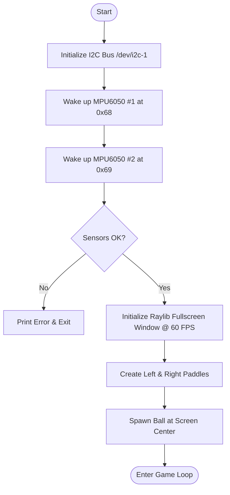
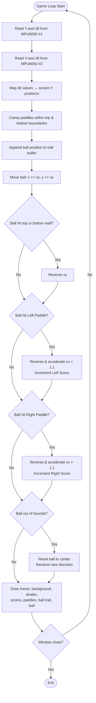
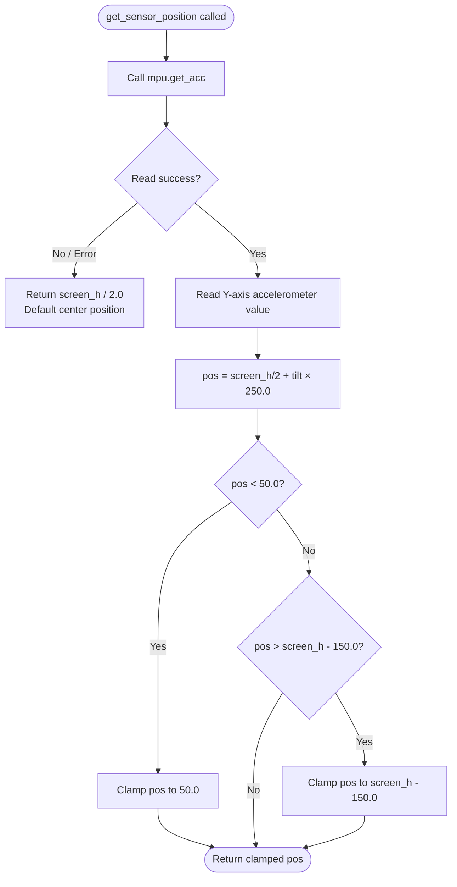
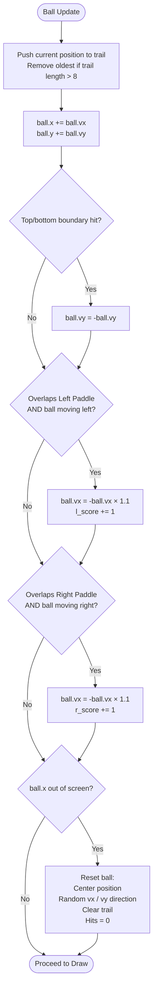

#  AirPaddle — Gesture-Controlled Ping Pong

> A multiplayer ping pong game where players control paddles using real-time hand gestures through MPU6050 motion sensors connected to a Raspberry Pi.

---

## 👥 Team Identity

**Studio / Group Name:** `AirPaddle — Group No. 21`

| Name | Primary Role | Secondary Role | Strengths |
|---|---|---|---|
| Sakshi Thakare | Electronics / Coding / App | Coding | Hardware |
| Viraj Pradhan | Electronics / Fabrication | Coding | Hardware |
| Umair Shaikh | Electronics / Coding / App | Documentation | Documentation, Communication |
| Bhushan Sonawane | Electronics / Fabrication | Documentation | Documentation, Communication |

---

## 💡 One-Line Pitch

**Hand-tilt your way to victory** — two MPU6050 sensors feed live motion data to a Raspberry Pi running a Rust + Raylib game engine, moving paddles in real time.

---

## 🎯 Project Idea

AirPaddle is a **gesture-controlled Ping Pong** game built using Raspberry Pi, MPU6050 motion sensors, and the Raylib graphics framework written in Rust.

Instead of keyboards or joysticks, each player physically tilts a handheld controller containing an MPU6050 sensor. The sensor detects upward and downward tilt through its accelerometer. These values are read via I2C directly on the Raspberry Pi, processed in Rust, and translated to real-time paddle movement on the display.

The entire game interface — start, gameplay, score, and restart — runs on the Raspberry Pi display screen, making it a fully self-contained embedded gaming system.

---

## ✨ Inspiration

| Source | What Inspired Us |
|---|---|
| [Instagram Reel — Projection Mapping](https://www.instagram.com/reel/DW4CT7WCDry/?igsh=cXg3dzAxYmdncDBo) | How projection mapping creates interactive digital + physical experiences |

**Original Twist:** Unlike traditional input-device ping pong, our system uses dual MPU6050 sensors with distinct I2C addresses (0x68 / 0x69) so both players are tracked simultaneously. The tilt-to-position mapping is computed directly in Rust with no middleware, giving instant, low-latency paddle response.

---

## 🗺️ User Journey

```
Player picks up sensor → Game launches on Raspberry Pi display
        ↓
Players tilt hands up/down → Paddles move in real time
        ↓
Ball bounces between paddles → Score tracked on screen
        ↓
Ball crosses boundary → Ball resets, game continues
```

---

## ✅ Definition of Success

| Version | What It Includes |
|---|---|
| **Minimum Usable** | Both MPU6050 sensors connected via I2C, basic Pygame/Raylib display with paddles and ball, gesture-based paddle control |
| **Full Success** | Smooth real-time motion tracking, correct ball physics, two players competing without lag, crashes, or sensor disconnects |

### 🚀 Stretch Features
- Smash detection using sudden acceleration spikes
- Scoreboard system with win tracking
- Sound effects and background music
- AI single-player mode
- Real-time motion visualization graphs
- Wireless sensor communication via ESP32
- Gesture calibration menu
- Full-screen arcade mode

---

## 🏗️ System Overview

**Project Type:** Electronics-based · Sensor-based · Screen/UI-based · Game logic · Fabricated structure · Sound-based

### Input / Output Map

| System Part | Type | What It Does |
|---|---|---|
| MPU6050 Sensor 1 (0x68) | Input | Detects hand tilt for Player 1 paddle |
| MPU6050 Sensor 2 (0x69) | Input | Detects hand tilt for Player 2 paddle |
| Raspberry Pi 4 | Processing | Reads sensor data and runs game logic |
| Rust + Raylib | Software | Renders game graphics and physics |
| HDMI Display | Output | Shows live ping pong gameplay |
| I2C Bus (SDA/SCL) | Communication | Transfers motion data from both sensors |

---

## ⚙️ Software Architecture & Flowcharts

### 1. System Startup Flow



---

### 2. Main Game Loop



---

### 3. Sensor Reading & Paddle Mapping



---

### 4. Ball Physics & Collision



---

## 🔌 Electronics & Wiring

### Components

| Component | Qty | Purpose |
|---|---:|---|
| Raspberry Pi 4 | 1 | Main processing unit |
| MPU6050 Motion Sensor | 2 | Player hand gesture detection |
| HDMI Display | 1 | Game interface output |
| Breadboard | 1 | Temporary prototyping |
| Jumper Wires | Several | I2C and power connections |
| Power Adapter (5V) | 1 | Powers Raspberry Pi |

### Wiring Plan

Both MPU6050 sensors share the same I2C bus. To avoid address conflicts:

| Pin | Sensor 1 | Sensor 2 |
|---|---|---|
| SDA | GPIO2 (Pin 3) | GPIO2 (Pin 3) |
| SCL | GPIO3 (Pin 5) | GPIO3 (Pin 5) |
| VCC | 3.3V | 3.3V |
| GND | GND | GND |
| AD0 | → GND → Address **0x68** | → 3.3V → Address **0x69** |

### I2C Address Assignment Diagram

```
Raspberry Pi 4
┌───────────────────────────┐
│  GPIO2 (SDA) ─────────────┼──┬──── MPU6050 #1  AD0→GND  (0x68)
│  GPIO3 (SCL) ─────────────┼──┤──── MPU6050 #2  AD0→3.3V (0x69)
│  3.3V        ─────────────┼──┤──── VCC (both sensors)
│  GND         ─────────────┼──┴──── GND (both sensors)
└───────────────────────────┘
```

---

## 💻 Software Stack

| Tool / Platform | Purpose |
|---|---|
| Rust (Edition 2024) | Main programming language |
| Cargo | Package manager & build system |
| Raylib 5.5.1 | Graphics rendering & game framework |
| `rand` crate | Random ball direction on reset |
| `linux-embedded-hal` | I2C device access on Linux |
| `mpu6050` crate | Sensor communication library |
| Raspberry Pi OS | Host operating system |

---

## 🚀 Getting Started

### Prerequisites

- Raspberry Pi 4 running Raspberry Pi OS (64-bit recommended)
- Rust toolchain installed (`curl --proto '=https' --tlsv1.2 -sSf https://sh.rustup.rs | sh`)
- I2C enabled on the Raspberry Pi (`sudo raspi-config` → Interface Options → I2C → Enable)
- Two MPU6050 sensors wired as described above

### Build & Run

```bash
# Clone the repository
git clone https://github.com/your-username/pingpong-software.git
cd pingpong-software

# Build the project
cargo build --release

# Run the game (requires sudo for I2C access)
sudo ./target/release/ping-pong
```

### Enable I2C on Raspberry Pi

```bash
# Enable I2C
sudo raspi-config nonint do_i2c 0

# Verify both sensors are detected
i2cdetect -y 1
# You should see 0x68 and 0x69 listed
```

---

## 📐 Physical Dimensions

| Dimension | Value |
|---|---|
| Length | 16 cm |
| Width | 16 cm |
| Height | 8 cm |
| Estimated Weight | ~400 g |

---

## 💰 Budget Summary

| Item | Cost (₹) |
|---|---:|
| Electronics | 400 |
| Mechanical Parts | 200 |
| Fabrication Materials | 0 (campus) |
| Contingency | 300 |
| **Total** | **900** |

---

## ⚠️ Risks & Mitigations

| Risk | Likelihood | Impact | Mitigation |
|---|---|---|---|
| I2C sensor disconnect during gameplay | Medium | High | Address-based separation (0x68/0x69); safe fallback returns center position |
| Sensor drift causing paddle jitter | Medium | Medium | Clamp paddle positions to screen boundaries |
| Raspberry Pi display latency | Low | Medium | Raylib targets locked 60 FPS with vsync |
| Power instability affecting sensor reads | Low | High | Dedicated 5V adapter; avoid USB hub power |

---

## 🧪 Testing Log

| Date | Test | Result |
|---|---|---|
| 18 Apr | I2C detection of both MPU6050 sensors | Both 0x68 and 0x69 detected |
| 20 Apr | Tilt-to-paddle mapping calibration | 250.0 multiplier gives smooth response |
| 22 Apr | Ball physics & bounce | Working correctly |
| 24 Apr | Full two-player gameplay session | Playable, minor jitter fixed with clamping |

---

## 🏁 Milestone Progress

| Milestone | Status |
|---|---|
| Idea finalized & BOM complete | ✅ Done |
| Electronics wired & I2C verified | ✅ Done |
| Rust game engine running with sensor input | ✅ Done |
| Physical enclosure fabricated | ✅ Done |
| Full two-player game playable | ✅ Done |
| Documentation complete | ✅ Done |

---

## 🔮 Future Improvements

- **Smash detection** — spike in acceleration triggers a fast ball
- **ESP32 wireless** — cut the wires, play wirelessly
- **Sound effects** — beeps and boops on every hit
- **AI opponent** — single-player mode against the computer
- **High score board** — persistent leaderboard on screen
- **Gesture calibration** — in-game sensor calibration menu

---

## 🔨 Build Documentation

### Fabrication Process

**Design (CAD Modeling)**
The controller housing was modelled in CAD software using the exact dimensions of the MPU6050 module and connecting wires. This ensured all cutouts and mounts aligned precisely with the hardware before any material was cut.

**Cutting (Laser Cutting)**
Structural panels and sensor mounts were laser-cut from sheet material following the CAD files. The precision cuts eliminated the need for post-cut drilling or filing on most parts.

**Assembly & Fastening**
Components were bonded with adhesive and mechanical supports. Sensor mounts were intentionally kept modular — not permanently glued — so the MPU6050 boards can be removed and reseated without disassembling the enclosure.

**Surface Finishing**
Rough edges from the laser cutter were sanded down. Gaps and small imperfections were filled using a sawdust-adhesive paste, then sanded flush. The finished enclosure was painted for durability and to give the controller a clean arcade look.

**Wiring Integration**
Jumper wires were routed inside the enclosure along channels designed into the CAD model, keeping the I2C lines (SDA / SCL) short to minimize signal noise. Both sensors were soldered to their AD0 pins (GND for 0x68, 3.3V for 0x69) before final assembly.

**Revisions**
- First iteration: sensor was loose inside housing → added foam padding and tighter mount
- Second iteration: wire routing caused strain on connectors → redesigned cable channel width
- Final iteration: fully assembled, both sensors stable, I2C reads consistent

---


## 🏁 Final Outcome

### What the Final Version Is

A fully working two-player gesture-controlled Ping Pong game running natively on a Raspberry Pi 4. Both players hold a handheld controller with an embedded MPU6050 sensor. Tilting the controller up or down moves their paddle in real time on the HDMI-connected display. The game tracks scores, speeds up the ball with every paddle hit (1.1× velocity multiplier), and resets automatically when the ball crosses a boundary. The entire stack — sensor reading, game logic, physics, and rendering — runs in a single Rust binary at a locked 60 FPS.

### ✅ What Works Well

- **Real-time gesture control** — tilt-to-paddle latency is imperceptible at 60 FPS
- **Dual I2C sensors** — 0x68 / 0x69 address separation works reliably with no conflicts
- **Ball physics** — bounce, acceleration on hit, and trail effect all feel responsive
- **Score tracking** — increments correctly on every paddle contact
- **Rust + Raylib performance** — no lag or frame drops on Raspberry Pi 4
- **Failsafe sensor read** — if a sensor read fails, paddle defaults to center rather than crashing

### 🔧 What Still Needs Improvement

- Ball speed increases indefinitely after many hits — needs a maximum velocity cap
- No win condition or game-over screen yet — game runs indefinitely
- Sensor calibration varies between players (hand size, grip angle) — a calibration step would help
- No sound effects — silent gameplay misses arcade feel
- Wires between Raspberry Pi and sensors limit player movement range

### 📋 What Changed From the Original Plan

| Original Plan | What Actually Happened |
|---|---|
| Python + Pygame for game logic | Switched to **Rust + Raylib** for better performance and lower latency |
| ESP32 as wireless bridge | Dropped — sensors wired directly to Raspberry Pi I2C, simpler and more reliable |
| OLED display for score | Used the main HDMI display for everything — OLED unavailable |
| External start/restart buttons | Handled entirely in software — buttons unavailable |
| Powerup / bomb / gem system | Struct and logic present in code but not yet triggered during gameplay |

---

## 💭 Reflection

### Team Reflection

The team divided work cleanly — hardware members focused on wiring, sensor calibration, and enclosure fabrication, while the software members handled the Rust game engine and I2C integration. Decision-making was fast because the team agreed early to cut scope (drop ESP32 wireless, drop external buttons) and deliver a working core experience.

What slowed us down most was the initial address conflict between the two MPU6050 sensors — both defaulted to 0x68 until we identified the AD0 pin fix. Once that was resolved, integration moved quickly.

Time management was strong in the first three bi-hours; the final bi-hour was tight and left some stretch features (sound, win screen) unfinished.

### Technical Reflection

- **Electronics:** Learned how I2C addressing works with multiple devices on one bus, and how the AD0 pin controls MPU6050 address selection
- **Coding:** Gained hands-on experience writing a real-time game loop in Rust, including ownership patterns with mutable sensor references passed into the game loop
- **Sensor integration:** Understood how raw accelerometer Y-axis values map to useful screen coordinates, and the importance of clamping to prevent paddles from going off-screen
- **Fabrication:** Laser cutting tolerances matter — a 0.5mm gap becomes visible after painting
- **Integration:** The biggest integration challenge was keeping the sensor read, game logic, and draw call all within a single 16ms frame budget

### Design Reflection

- **Designing for interaction:** Tilt controls feel intuitive instantly — no explanation needed, which validated the gesture-first design choice
- **Delight:** Players immediately tried to do fast flick motions — adding smash detection would reward that instinct
- **Clarity:** The minimal black-and-white visual style keeps focus entirely on the ball and paddles — no visual clutter
- **Physical interaction:** The handheld sensor form factor makes it feel like a real game controller, not a prototype
- **Iteration:** Every physical revision (sensor mount, cable routing) made the next test session faster and more reliable

### If We Had One More Hour

We would add a **win condition and game-over screen** — first to 10 points wins, then show a winner screen with a restart prompt. This single addition would make AirPaddle feel like a complete game rather than an infinite demo. Second priority would be a **maximum ball speed cap** to prevent the game from becoming unplayable after many consecutive hits.

---

## ✅ Final Submission Checklist

- [x] Team details complete
- [x] Project description complete
- [x] Inspiration sources included
- [x] Sketches and architecture diagrams added
- [x] BOM complete
- [x] Purchase list complete
- [x] Budget summary complete
- [x] Mechanical planning documented
- [x] Code flowcharts added (4 Mermaid diagrams)
- [x] Task breakdown complete
- [x] Risk register complete
- [x] Testing log updated
- [x] Playtesting notes included
- [x] Build photos included
- [x] Final reflection written
- [x] GitHub README complete


---

*AirPaddle — Group 21 | Skill Lab Practical Hackathon 2026*
